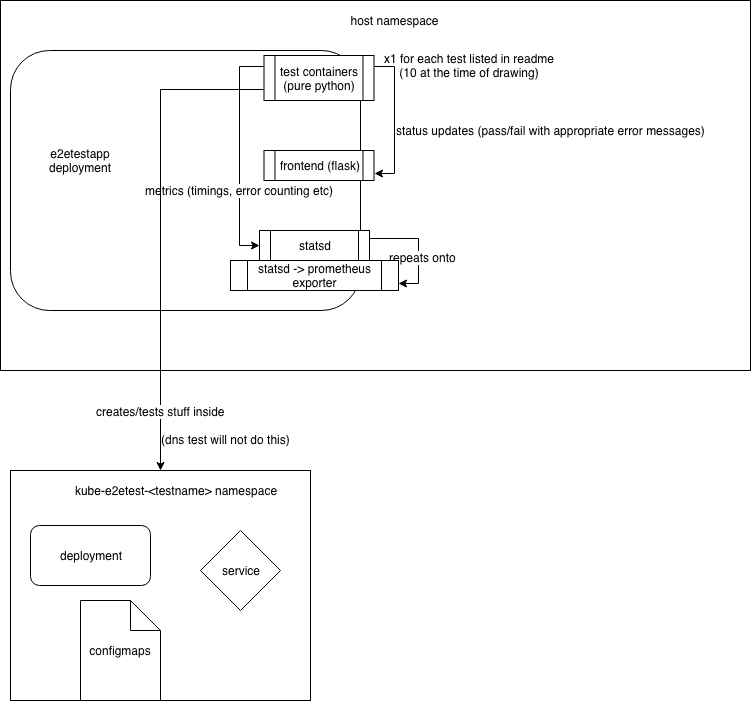

# Contributing
We welcome new contributors to this project. To get started we recommend checking out and commenting on the issues, or raising a new one if you find a bug and/or would like to write a new feature.

## Style & Quality
Commits to this repository should follow the [angular commit message style](https://github.com/angular/angular/blob/master/CONTRIBUTING.md#rules).

Testing this sort of thing is difficult and leans more toward integration testing than unit testing in general - there are some unit tests in `./tests` which mostly cover the frontend which is much easier to mock out and test individually. We'd especially appreciate contributions here.

Travis-CI is configured to build, test and deploy (on merge) the docker image to the Docker Hub.

## Design/Architecture
The following diagram explains how the app works and should give some insight into adding new tests:

Note that the part about creation of resources varies depending on the test. Wherever tests are checking functionality rather than creation, they should create new resources the first time and leave them there for future tests. E.g the service test is checking kubernetes can create a service, so should create, check and delete it, but the deployment service test is checking services and deployments can effectively work together, so should only create resources if it does not already exist.

